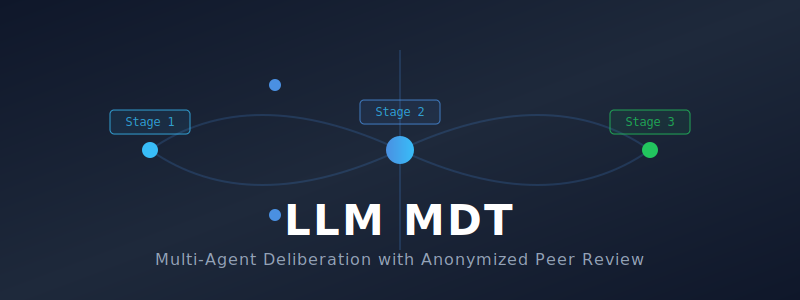

<div align="center">
  

  <h1>LLM MDT (Multi-Disciplinary Team)</h1>

  <p><b>A local web app that treats LLMs as a medical-style Multidisciplinary Team.</b><br/>Models generate independently, review each other <i>anonymously</i>, and a Chairman synthesizes the perfect answer.</p>

  <p>
    <a href="https://github.com/yhzhu99/llm-mdt/stargazers"></a>
    <a href="https://github.com/yhzhu99/llm-mdt/network/members"></a>
    
    
  </p>
</div>

---

## 💡 The Core Problem It Solves

If you ask GPT-4, Claude, and Gemini to rate each other's answers, **they are heavily biased toward their own outputs or specific model names**.

`llm-mdt` solves this by introducing **Anonymized Peer Review**.

Based on our research paper [**ColaCare** (WWW 2025) 📄](https://arxiv.org/abs/2410.02551), this project implements a 3-stage deliberation pipeline that extracts the absolute best reasoning from multiple models without identity bias.

<div align="center">
  
</div>

## ✨ Features

- 🎭 **Anonymized Peer Review:** Responses are relabeled as *Response A, B, C* during Stage 2. Reviewers vote based on pure logic, not brand bias.
- ⚡ **Local, ChatGPT-like UI:** A beautiful, responsive React frontend with streaming support.
- 🔍 **Total Transparency:** Inspect raw outputs, reasoning (thinking) processes, and parsed rankings via a clean Tab interface.
- 🛡️ **Graceful Degradation:** The council continues deliberation even if one API endpoint fails or times out.
- 💾 **Local Storage:** Conversations are saved cleanly in local JSON files.

## 🚀 Setup & Installation

### 1. Install Dependencies

We use [`uv`](https://docs.astral.sh/uv/) for blazing-fast Python environment management.

**Backend:**
```bash
cd backend
uv sync
```

**Frontend:**
```bash
cd frontend
npm install
cd ..
```

### 2. Configure API Keys

This project uses an **OpenAI-compatible** Chat Completions endpoint. By default you can use **OpenRouter** directly, or route requests via **ZenMax** (as an API relay).

- OpenRouter base URL (recommended default):
  - `https://openrouter.ai/api/v1/chat/completions`
- ZenMax base URL (relay):
  - `https://zenmux.ai/api/v1/chat/completions`

If your deployment supports it, set the base URL via environment variable or update `backend/config.py` (`OPENROUTER_API_URL`) to point to the endpoint you want.

Create a `.env` file in the project root:

```env
OPENROUTER_API_KEY=sk-or-v1-...
```

*(By default, the project uses ZenMax / OpenRouter. Get your keys at [openrouter.ai](https://openrouter.ai/) or [zenmux.ai](https://zenmux.ai/).)*

### 3. Customize Your Council (Optional)

Edit `backend/config.py` to change the models in your council or appoint a different Chairman:

```python
COUNCIL_MODELS = [
    "openai/gpt-5.2",
    "google/gemini-3-pro-preview",
    "deepseek/deepseek-reasoner",
]
CHAIRMAN_MODEL = "google/gemini-3-pro-preview"
```

## 🎮 Running the App

The easiest way to start both the backend and frontend is using the included script:

```bash
./start.sh
```

Alternatively, run them manually in separate terminals:
- **Backend:** `uv run python -m backend.main`
- **Frontend:** `cd frontend && npm run dev`

Open [http://localhost:5173](http://localhost:5173) in your browser to start your MDT session!

## 📚 Background & Acknowledgements

The core idea—LLM-driven multi-agent collaboration for “team-style” reasoning—was explored in our published work:
- 📖 **Paper:** *ColaCare: Enhancing Electronic Health Record Modeling through Large Language Model-Driven Multi-Agent Collaboration* (**WWW 2025**)
- 🔗 **arXiv:** [https://arxiv.org/abs/2410.02551](https://arxiv.org/abs/2410.02551)

This codebase structure is inspired by Andrej Karpathy's excellent [llm-council](https://github.com/karpathy/llm-council) prototype, significantly expanded with a modern UI, streaming, anonymization, and persistent storage.

---
<div align="center">
  <i>If you find this project useful, please consider giving it a ⭐ to help others discover it!</i>
</div>
